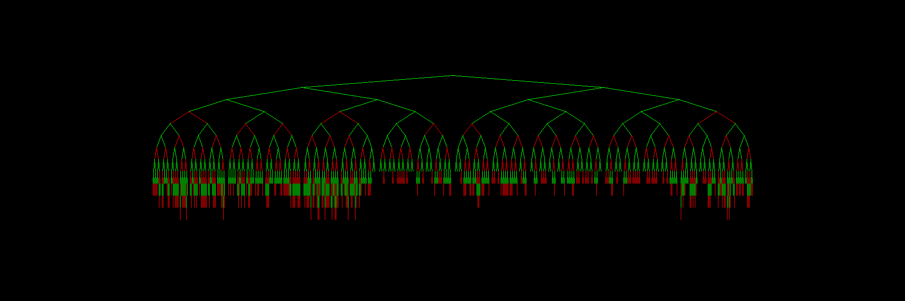

# TREE

Animates a Red Black Tree in the festive Christmas spirit of red and green.

# References

For implementation details, see:
    https://en.wikipedia.org/wiki/Red%E2%80%93black_tree

Non-recursive details and property checking borrowed from:
    https://github.com/prasanthmadhavan/Red-Black-Tree
